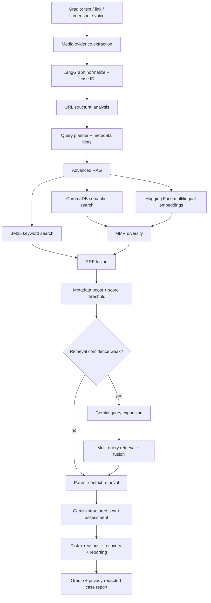

# ScamShield AI architecture

## Why this is agentic

LangGraph controls a stateful, inspectable workflow rather than using one giant prompt. Retrieval can branch into multi-query expansion only when the initial retrieval is weak. This keeps normal requests fast while improving difficult Urdu/Roman-Urdu or ambiguous cases.

## RAG design

- Child sections are indexed for precise matching.
- Parent summaries restore broader context after retrieval.
- Hugging Face multilingual embeddings handle semantic meaning across English, Urdu, and Roman Urdu.
- BM25 catches exact indicators such as OTP, CNIC, WhatsApp, JazzCash, and specific organization names.
- MMR reduces repetitive semantic results.
- Reciprocal Rank Fusion combines semantic and keyword rankings.
- Metadata hints boost Pakistan-specific and scam-type-specific sources.
- A confidence gate triggers multi-query expansion only when needed.
